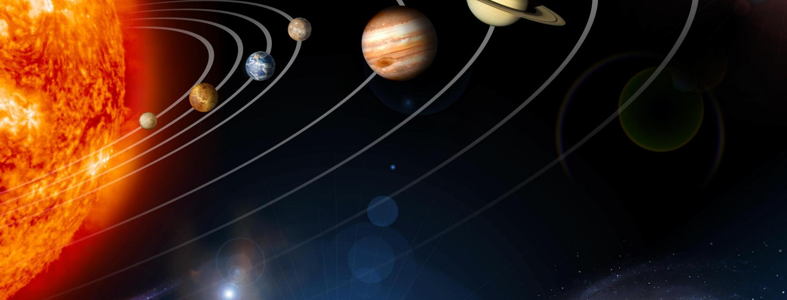
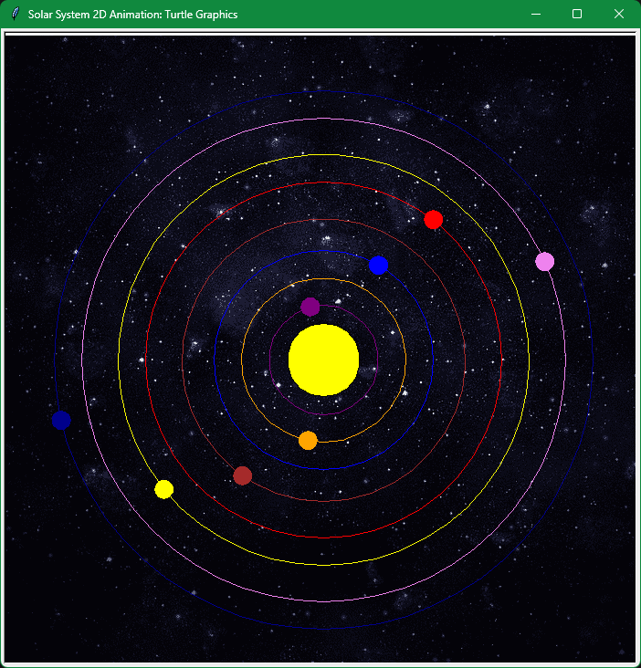
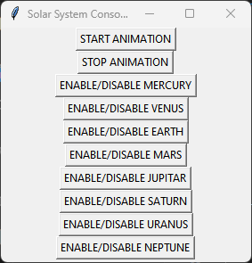

  
  <h1>Solar-System-2D-Animation</h1>

Small project designed for the curious minds to experiment with the synergy of math and graphics. Using Turtle graphics, this simulation brings the majestic dance of celestial bodies in our solar system in 2-dimensional perspective 
  
### CALCULATIONS
Basic math and graphic techniques are applied in px `(pixels)` using xy-plane coordinates including the velocity, size & orbit of the planets. A frame consist of one xy-step for each planet. For higher FPS `Frames Per Second` the orbit is pre-calculated after rendering the object.

* Frames:

  Each frame is a one-step `Prograde`  in xy-plane. For all 360 degrees around the star its orbiting.

* Orbit (Prograde step per frame) :

  Each orbit is a circler circle around the star, can be changed manually. Calculated as follows
  
  `x = x  +  planet radius  x  Cosine (start angle in radians)`
  * Circular Orbit: `y = y +  planet radius  x  Sin (start angle in radians) + star size` 
  * Elliptical Orbit: `y = y +  planet radius  x  Sin (start angle in radians)` 

  Where `radius = star size (in px) + planet distance from the star`, `start angle = 0`, then gets incremented by the velocity of the planet up to `angle = 360`

### FUNCTIONALITY

* Trigger planet animation:

  All planets are stored in a list `Array`. Stopping an orbit is simply removing it from the animation list. Resuming it by adding the object into the planets list.

### SCREENSHOTS

 
